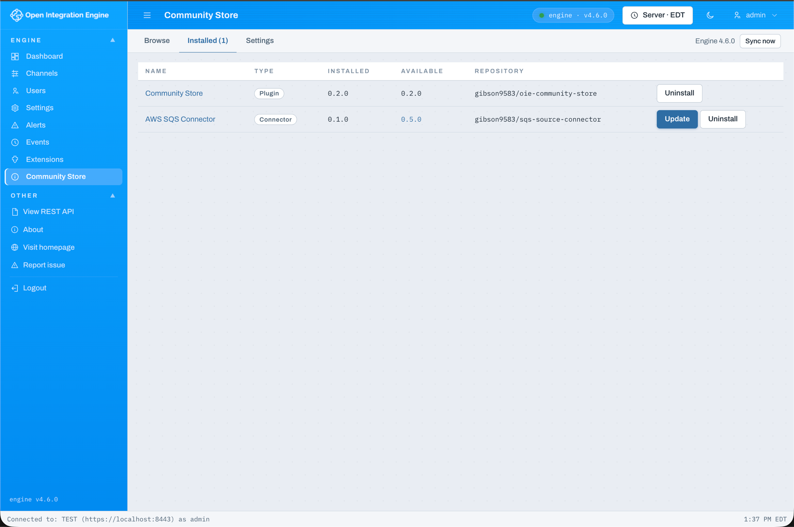
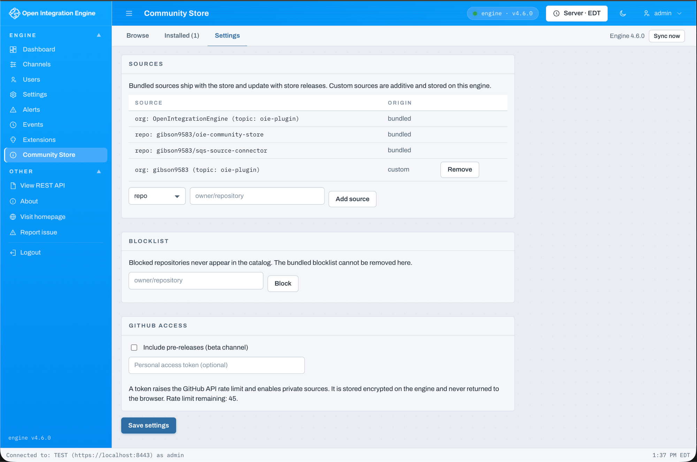

# OIE Community Store

A community plugin store for [Open Integration Engine](https://openintegrationengine.org), modeled on the HACS approach: no project-hosted infrastructure, just git. Publisher repositories and organizations are listed in a bundled sources file, each publisher describes releases with an `oie.json` manifest, installable artifacts are `.zip` assets on GitHub Releases, and the engine downloads, sha256-verifies, and installs them through its own extension installer.

## Screenshots

**Browse** — discover connectors, plugins, and data types resolved from GitHub Releases:


**Installed** — track what's installed and see available updates (including the store updating itself):



**Settings** — bundled and custom sources, a local blocklist, the beta channel, and an optional encrypted GitHub token:



## Architecture

This is a standard engine extension (Java backend) paired with a web administrator plugin (React frontend), shipped together in one extension zip.

* **Engine side** (`src/main/java`): a `ServicePlugin` plus a JAX-RS servlet at `/api/extensions/communitystore`. It owns all GitHub communication (org enumeration by topic, release resolution, ETag-cached conditional requests, optional PAT), downloads and verifies artifacts against their `.sha256` sidecars, pre-flights the zip, and delegates installation to `ExtensionController.extractExtension`, the same code path as a manual install.
* **Web side** (`webadmin/`): a React module for the OIE web administrator with Browse, Installed, and Settings views. The browser never talks to GitHub and never handles artifacts; it only calls the servlet.

Every REST operation, including catalog reads, is gated by the engine's existing `manageExtensions` permission (`Permissions.EXTENSIONS_MANAGE`). Store access is exactly extension-install access. Installs and uninstalls dispatch server events (user, extension, repo, tag, checksum) to the engine event log.

The servlet deliberately exchanges raw JSON strings rather than typed model classes. This keeps third-party classes out of the engine's XStream serialization pipeline and its security allowlist, and gives the frontend clean JSON without the single-element-list conversion quirk.

## Building

Requires JDK 17+, Maven, and an OIE installation (or built engine tree) to compile against:

```
OIE_HOME=/path/to/oie mvn package
```

The build compiles the jar, builds the web frontend (`webadmin/web/plugin.jsx` to `plugin.js` via esbuild through `frontend-maven-plugin`), and assembles the installable extension at `target/communitystore-0.1.0.zip` with the layout:

```
communitystore/
├── plugin.xml
├── communitystore-shared.jar
└── webadmin/
    ├── plugin.json
    └── web/plugin.js
```

The `mirthVersion` in `plugin.xml` must match your engine version (comma-separated values are accepted by the engine's compatibility check).

## Continuous integration & releases

Two GitHub Actions workflows build the extension without a local OIE install — they download a published OIE distribution and point `OIE_HOME` at its `server-lib` jars:

* **`build.yml`** runs on every push and PR: compiles the jar, builds the frontend, runs the web-plugin tests, and uploads the extension zip as an artifact.
* **`release.yml`** runs on a semver tag (`v*`): it stamps the tag version into the pom, `plugin.xml` (`pluginVersion`), and `webadmin/plugin.json`, verifies `oie.json` matches, builds, and publishes `communitystore-<version>.zip` plus its `.sha256` sidecar.

The OIE version supplying the compile-time jars is pinned via the `OIE_TAG` / `OIE_TARBALL` env vars at the top of each workflow; bump them when the engine API you build against moves.

To cut a release: set `version` in `oie.json` to the new value (keep it in sync with the pom), commit, then `git tag vX.Y.Z && git push origin vX.Y.Z`. Stamping the version into `plugin.xml` matters — the engine reports that as the *installed* version, so if it lagged `oie.json` the store would show a perpetual self-update.

## Installing

Install `communitystore-<version>.zip` through Extensions in either administrator, restart the engine, and the Community Store appears in the web administrator navigation. The web half is served by the engine (`/api/webplugins/communitystore/...`), so it follows the engine it is installed on.

The store lists its own repository as a source and ships an `oie.json`, so it is **self-updating**: once a newer release is published, the store flags it as an available update in the Installed tab (and installs it through the same verified flow as any other extension).

## Sources

The bundled default source list lives at `src/main/resources/sources.json` and updates via PR to this repository:

```json
{
    "schemaVersion": 1,
    "sources": [
        { "kind": "org", "org": "OpenIntegrationEngine", "topic": "oie-plugin" },
        { "kind": "repo", "repo": "acme-health/oie-sqs-connector" }
    ],
    "blocklist": []
}
```

* `repo` entries point at one repository.
* `org` entries include every public repository under an account that carries the topic (default `oie-plugin`). The account may be a GitHub **organization or a personal user** — the store resolves the account type and enumerates accordingly. A publisher under a listed account adds a plugin to the store by tagging the repository with the topic and cutting a release, with no registry change.

Administrators can add custom sources and local blocklist entries at runtime in Settings; those persist on the engine. The bundled blocklist always applies.

## Publisher contract

> **Publishing an extension?** See the full **[Publishing guide](docs/PUBLISHING.md)**
> for a step-by-step walkthrough, the [`oie.json` schema](docs/oie.schema.json), and
> copy-paste [examples](examples/) (manifest, store docs, and a GitHub Actions release
> workflow). The summary below is the contract in brief.

A listed repository must provide:

1. **`oie.json` at the repository root**, read at the release tag so metadata is per-version:

```json
{
    "schemaVersion": 1,
    "id": "sqs-connector",
    "name": "SQS Source Connector",
    "description": "Consume messages from Amazon SQS queues as a channel source.",
    "type": "connector",
    "version": "1.4.0",
    "minEngineVersion": "4.5.0",
    "maxEngineVersion": null,
    "filename": "sqs-connector-{version}.zip",
    "restartRequired": true,
    "homepage": "https://github.com/acme-health/oie-sqs-connector",
    "documentation": "https://github.com/acme-health/oie-sqs-connector/wiki",
    "license": "MPL-2.0",
    "authors": ["Acme Health Integration Team"],
    "keywords": ["aws", "sqs", "queue", "source"],
    "storeDocs": "docs/store.md",
    "deprecated": false
}
```

`id` must equal the `path` attribute of the extension's `plugin.xml`; the store refuses mismatched artifacts, and the match is what ties store records to the engine's installed inventory for update detection. `version` must equal the release tag (modulo a leading `v`). `type` is one of `connector`, `plugin`, `datatype`, `code-template-library`, `channel`. `filename` is optional; the default rule is the single `.zip` asset on the release, with `{version}` substitution supported.

2. **Store documentation (optional).** The detail view renders publisher markdown, read at the release tag so docs are versioned with the artifact. Resolution order: the manifest's `storeDocs` path, then `store.md`, `docs/store.md`, and `README.md`. Relative links resolve to the repository at the tag; relative raster images (png/jpg/gif/webp) are fetched server side and inlined as data URLs so they render under the administrator's CSP without the browser ever contacting GitHub. Raw HTML in the markdown is escaped, and link protocols are allowlisted, so publisher docs cannot script the administrator session.

3. **GitHub Releases with semver tags.** Each release attaches the extension `.zip` plus a `<asset>.zip.sha256` sidecar (plain hex, `sha256sum` output, or BSD format all parse). Missing or mismatched checksums abort the install before anything touches the extensions directory.

Release resolution is newest-compatible: the store walks releases newest to oldest and offers the first whose `minEngineVersion`/`maxEngineVersion` window contains the running engine version. Pre-releases are skipped unless the beta channel is enabled in Settings.

## Security notes

* Artifacts are verified server side against the published sha256 before installation. This proves transport integrity, not publisher identity; the sidecar comes from the same release. Artifact signing is a planned follow-on.
* The install confirmation states plainly that community content is not vetted by the OIE project. Installing an extension runs its code in the engine; the trust model is identical to manual extension installs.
* The optional GitHub PAT is stored encrypted via the engine's configuration encryptor and is never returned to the browser (write-only setting).
* Pre-flight rejects zips containing path traversal entries and descriptor/id mismatches.
* Publisher documentation renders through a sanitizing markdown pipeline: raw HTML is escaped rather than passed through, and only http, https, mailto, and fragment link targets are allowed. Documentation is cached engine-side per repo and tag (immutable refs), capped at 512 KB.

## Current limitations

* Content types (`code-template-library`, `channel`) appear in the catalog but are not yet installable through the store; binary extension types install fully.
* No dependency resolution between plugins.
* Update detection relies on `id` matching the extension path and versions being comparable semver.
* A validator GitHub Action for the publisher contract (manifest schema, tag/version match, checksum presence) is planned as a sibling repository.

## License

MPL-2.0, matching the engine.
