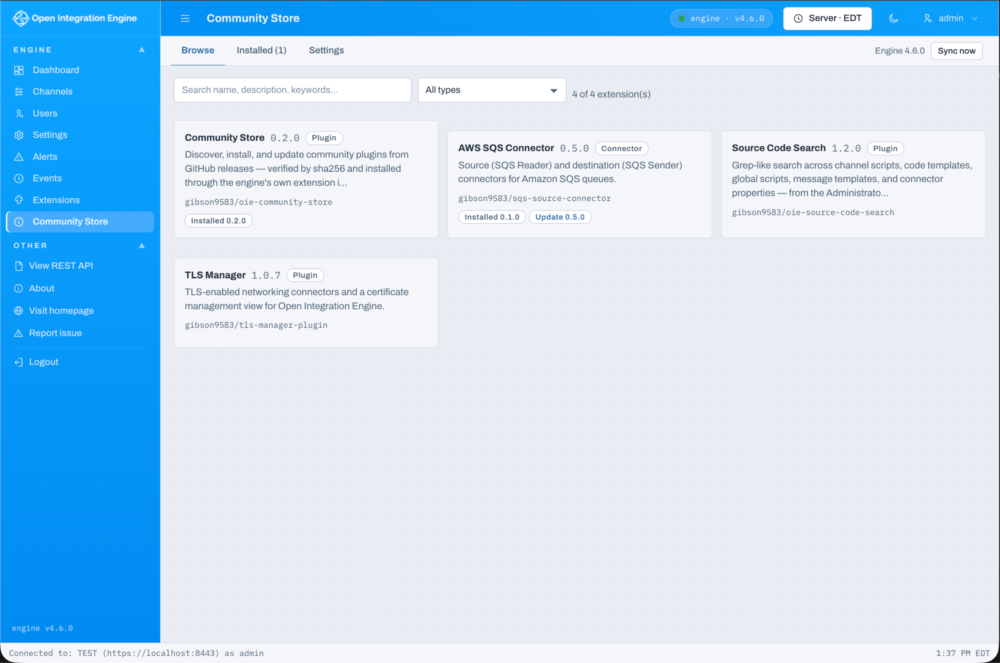

# Community Store

A community package store for Open Integration Engine with no project-hosted
infrastructure: a curated **catalog** (a static, PR-reviewed index whose entries
carry an artifact URL on any https host plus its sha256) is the primary source, and
GitHub repositories/organizations can be crawled directly as a zero-setup publishing
on-ramp. The engine downloads, sha256-verifies, and installs everything itself.

## Features

- **Browse** community connectors, plugins, data types, **channels, and code
  templates** — grouped by type, in card or table view.
- **Extensions** install and update through the engine's own extension installer
  (restart required; uninstall from the engine's Extensions page); **content** (channels, code templates, code template libraries) is
  imported through the engine's APIs and takes effect immediately. A standalone code
  template asks which library to add it to — new or existing.
- **sha256 verification** of every artifact before anything touches the engine,
  gated by the existing manage-extensions permission.
- **Self-aware updates** — the store is listed in the catalog, so a newer release
  shows up as an update like any other package.
- **Revocation alerts** — packages you installed that are later removed or blocked
  by their source are flagged in red on the Installed tab so you can remove them
  from the Extensions page.
- **Settings** for custom sources (catalog indexes, repositories, org/user topic
  crawls), a local blocklist, the beta channel, sync interval, and an optional
  (encrypted) GitHub token — which is only ever sent to GitHub, never to third-party
  hosts.

## How it works

The browser never talks to GitHub or artifact hosts. A Java service plugin running
inside the engine does all fetching, verification, and installation; the web
administrator only calls its REST endpoints.

## Installing

Install through Extensions in either administrator, restart the engine, and the
**Community Store** appears in the web administrator navigation. After the first
install it can update itself from the store.

See the [project README](https://github.com/gibson9583/oie-community-store#readme),
the [publishing guide](https://github.com/gibson9583/oie-community-store/blob/main/docs/PUBLISHING.md),
and the [community catalog](https://github.com/gibson9583/oie-community-catalog).
